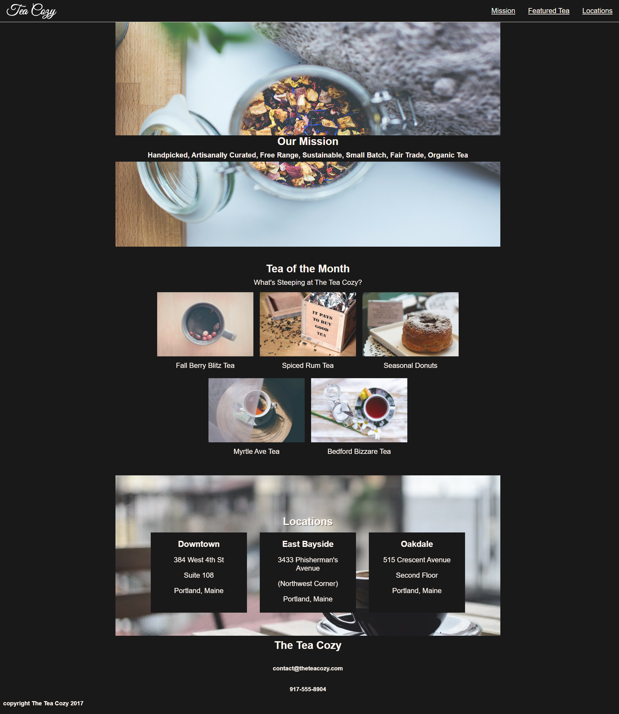
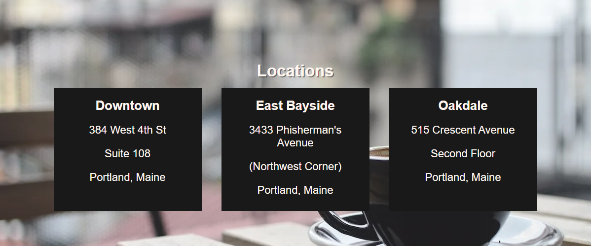

# Codecademy: Tea Cozy Project

This solution is for the Codecademy off-platform Tea Cozy project, part of the course 'Build a Website with HTML, CSS, and GitHub Pages'.

Link: https://www.codecademy.com/paths/learn-how-to-build-websites/tracks/advanced-css-flexbox-and-animations/modules/layout-with-flexbox/projects/tea-cozy

Link to live page: https://liyyy9.github.io/Codecademy-TeaCozyProject/

## Screenshot of final project


## Things I'm proud of 

1. I'm proud of figuring out how to overlay text on top of the background image. 

```
.mission {
    position: relative;             // setting container to relative
}

.content {
    display: flex;
    flex-direction: column;
    position: absolute;
    top: 50%;
    background-color: black;        // setting content to absolute
    width: 100%;
}
```

**Explanation:**

You need to set the container to relative and the content to absolute in order to position the content precisely within the container. Here's why:

- **Relative Positioning (relative)**: When you set the container's position to relative, it establishes a reference point for the absolutely positioned content inside it. This means any content with absolute positioning will be positioned relative to this container.

- **Absolute Positioning (absolute)**: When you set the content's position to absolute, it allows you to place it anywhere within the container, using coordinates (top, right, bottom, left) relative to the container’s edges. Without setting the container to relative, the absolute content would be positioned relative to the nearest positioned ancestor or the entire document, which is not what you want in this case.

In summary, setting the container to relative and the content to absolute creates a positioning context where the content can be placed precisely over the background image.

## Things to work on

I wish I could figure out how to handle this section properly. I'm not satisfied with how it's not perfectly centered within the div. Additionally, the address "3433 Phisherman's Avenue" should be displayed on a single line instead of wrapping. Despite trying various methods, I haven't been able to resolve these two issues.

